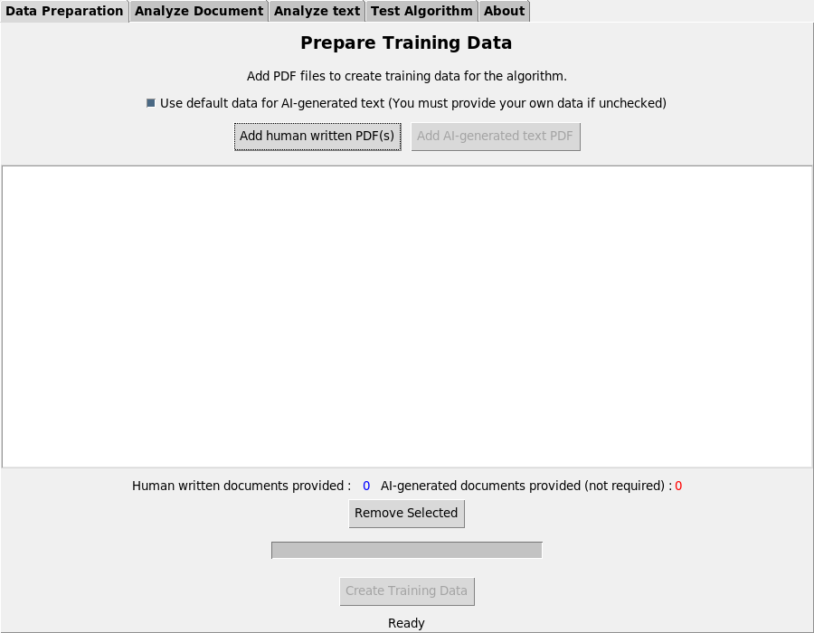
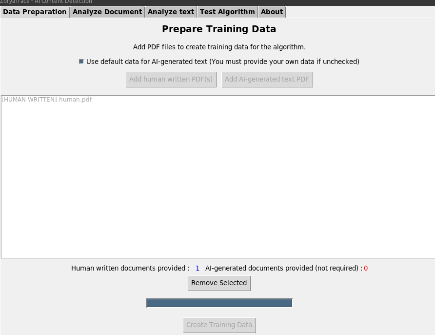
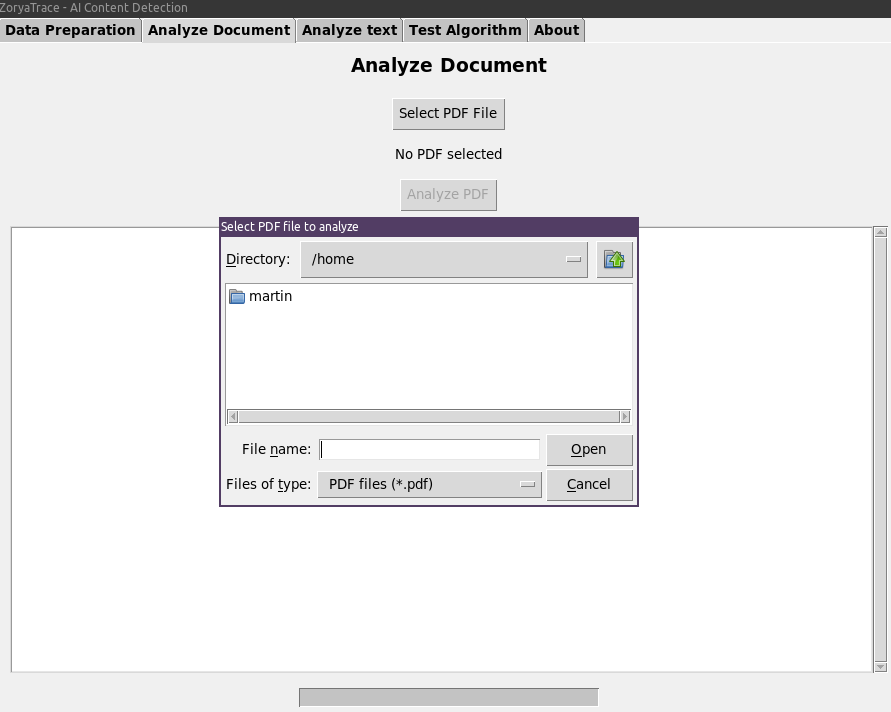
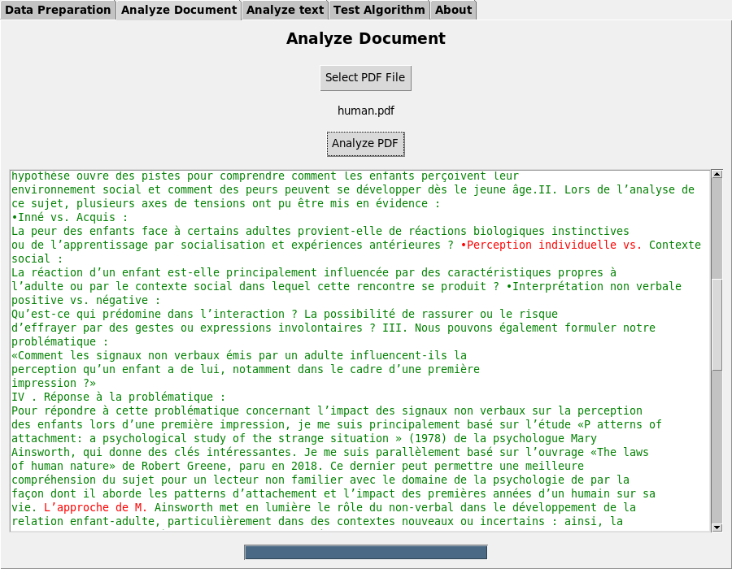
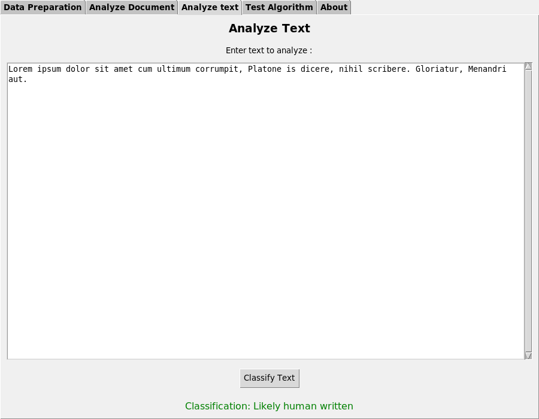
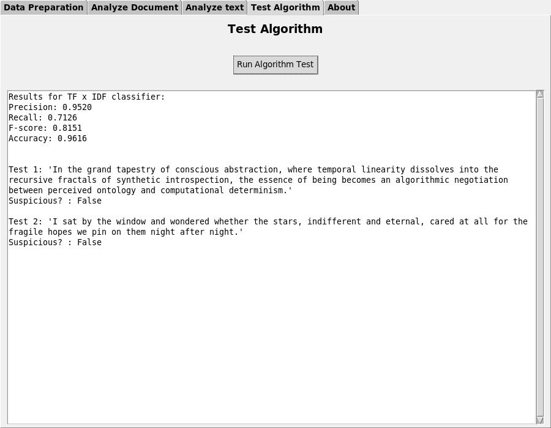
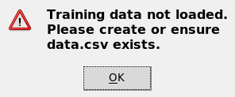

<p align="center">
  
</p>

**ZoryaTrace** is a powerful artificial intelligence algorithm designed to analyze texts and determine whether the content is AI-generated or not. ZoryaTrace leverage individual user data to determinate if LLM was used to generate text. To get into the mathematical details, **ZoryaTrace** uses the <i>[Naive Bayes classifier](https://en.wikipedia.org/wiki/Naive_Bayes_classifier)</i>, which is based on the <i>[Bayes' theorem](https://en.wikipedia.org/wiki/Bayes%27_theorem)</i> to achieve this goal.

🚧 **Currently in development** – many features are still being built and refined. 

📚 **Project progress :** 

📜 **Informations (13 april 2025) :** The data extractor, the algorithm (backend) and the interface (```zorya.py```) have been developed. I've also written the full documentation. I still have to implement default ai-generated training data. 
- So you can now use it completely, but default data files are not yet available, and you'll have to use AI-generated text data that you've put together yourself. Fortunately, I'll be adding the training data soon, so don't worry.

## Table of Contents  
- [Features](#features)
- [Disclaimer](#disclaimer)
- [Limitations](#limitations)
- [Installation](#installation)
- [Usage](#usage)
- [Algorithm Overview](#algorithm)
- [Ressources](resources)
- [Contributing](#contributing)
- [License](#license)
- [Credits](#credits)

## Features  
- **AI Detection -** Analyze text to classify AI-generated content.  
- **User-Based Analysis -** Adapt detection based on individual user patterns.  
- **Scalability -** Designed to handle large-scale text processing.  

### 🆚 Comparison Table: Why ZoryaTrace ?  

| Feature            | ZoryaTrace | Other Solutions |
|--------------------|--------------|--------------------|
| **Privacy-focused** | ✅ No user tracking, fully local processing | ❌ Often cloud-based, collects user data |
| **Efficiency** | ✅ Optimized TF-IDF & Naive Bayes, few seconds analysis | ⚠️ Can be slow due to complex models or API calls |
| **Ease of Use** | ✅ Easy setup | ❌ Requires API keys, dependencies, or manual setup |
| **Customization** | ✅ Fully customizable training dataset | ❌ Limited or no customization options |
| **Lightweight** | ✅ Minimal dependencies, runs on low-end devices | ❌ Heavy dependencies, requires cloud infrastructure |
| **Open Source** | ✅ Transparent and modifiable | ❌ Often proprietary and closed-source |
| **No API Limits** | ✅ Works offline, no request limits | ❌ API-based, limited free requests |
| **Security** | ✅ Local execution, no external data leaks | ❌ Data sent to third-party servers |


### 📖 Why the name "Zorya" ?
Zorya refers to two (sometimes three) deities in Slavic mythology — Zorya Utrennyaya (Morning Star) and Zorya Vechernyaya (Evening Star), occasionally joined by Zorya Polunochnaya (Midnight Star). These celestial sisters serve as guardians of Simargl, a cosmic hound chained to the star Polaris. If the chain ever breaks, it is said that the universe would be destroyed.

The Zoryas are tasked with watching the sky, opening the gates of the Sun each morning and closing them each night. They represent constant vigilance, protection against unseen threats, and balance between light and darkness.

ZoryaTrace draws inspiration from this mythos: just as the Zorya monitor the heavens for signs of cosmic disruption, the tool monitors digital texts to detect traces of artificial generation. The goal is not to judge, but to provide early signals, protect informational integrity, and offer clarity.

## Disclaimer
**Please Read Carefully**

ZoryaTrace is provided as an experimental tool for content analysis and educational research purposes. By using this software, you acknowledge and agree to the following:

- The results produced by ZoryaTrace are **probabilistic in nature** and do not constitute definitive or authoritative assessments.
- The tool **may generate false positives or false negatives**, and must **not** be solely relied upon for critical decisions.
- ZoryaTrace is **not certified** for legal, regulatory, compliance, or forensic use.
- The accuracy and reliability of outputs depend heavily on the **quality and relevance of the underlying data**.
- The developers, contributors, and associated entities **assume no liability** for any direct or indirect damages, losses, or consequences resulting from the use or interpretation of the software’s outputs.
- Use of this tool is **entirely at the user's own risk**.

### Recommended Best Practices:
1. **Always conduct a human review** of any content flagged or analyzed by the tool.
2. For professional or domain-specific usage, consider **retraining the model** on relevant datasets.
3. Maintain proper **audit logs and documentation** for transparency and accountability.
4. Ensure that your use of the software complies with **applicable laws and ethical guidelines** in your jurisdiction.

By proceeding, you acknowledge your understanding of these limitations and agree to use ZoryaTrace responsibly.

## Limitations
As explained above, ZoryaTrace is still under development. This means that you can't download the executables directly at the moment, you have to run it in a python environment, as explained below. In addition, some databases are not currently provided; you need to provide your own to run ZoryaTrace. 
This will be temporary, as the project is evolving very quickly.


## Installation
### Option 1: From Source (Recommended)
```bash
git clone https://github.com/Malwprotector/ZoryaTrace.git
cd zoryatrace
pip install -r requirements.txt
```
Then run it with
```bash
python3 zorya.py
```

### Option 2: Pre-built Executable
_Windows, Linux and Mac binaries will be available here soon !_

### System Requirements
- Python 3.8+
- 1GB RAM minimum (4GB recommended)
- 200MB disk space 


## Usage 
### 🖥️ Application Interface Overview

*Main application window with tab navigation*

### 📚 1. First, we need to create training data !
- You'll need to create training data before analyzing things. _But don't worry, everything will be explained simply !_ ✨
### Step 1: Add Training Files
1. Click "Add human written PDF(s)" to import your human written data. You can import several : the aim is to import as many PDFs written by a human as possible. If you want to base yourself on a particular subject or langage, you can import the data for that subject.
2. Toggle checkbox to use default suspicious data or add custom data. So in fact, you don't have to import data written by an Artificial Intelligence, because ZoryaTrace comes with this data. But as mentioned above, if you're working on a particular subject and you have text data generated by Artificial Intelligence, you can import that too.
3. View loaded files in the listbox.

### Step 2: Create Training Data

1. Click "Create Training Data".
2. The training data file is named `data.csv`, and it will be saved in the same directory of ZoryaTrace.
3. Monitor progress in status bar (It's often extremely fast).
4. Completion notification will appear !
5. Now that you have created the training data, you can use the algorithm freely. Make sure you don't delete or move your `data.csv` training data file.

### 🗺️ Exploring tabs

### 📄 4. Analyze PDF Tab
- This is ZoryaTrace's main function. Here, you submit written files, and the algorithm analyses them to determine the percentage of content generated by AI.
### Step 1: Load PDF

1. Click "Select PDF File".
2. Choose document to analyze.
3. Filename appears in status.
### Step 2: Run Analysis

1. Click "Analyze PDF".
2. Watch real-time progress bar (often very fast).
3. Results display with:
   - 🔴 Red highlighted suspicious sentences.
   - 🟢 Green neutral text.
   - Summary statistics.

### 🔍 2. Classify Text Tab

1. Paste or type text in the input box.
2. Click "Classify Text".
3. View results:
   - 🟢 Green = Neutral.
   - 🔴 Red = Suspicious.

### 🧪 3. Test Algorithm Tab

1. Click "Run Algorithm Test"
2. View metrics:
   - Precision
   - Recall
   - F-score
   - Accuracy
3. Sample test sentences with predictions


<!--### 🎥 Workflow Demonstration

*End-to-end usage example showing:*
1. Data preparation
2. PDF analysis
3. Results interpretation-->

### ⚠️ Troubleshooting Common Issues



**Problem**: "Training data not loaded"  
**Solution**:
1. Navigate to Data Preparation tab.
2. Ensure both human written and ai-generated samples are loaded.
3. Verify `data.csv` exists in working directory.

**Problem**: Slow PDF processing  
**Solution**:
1. Split large documents (>50 pages).
2. Close other memory-intensive applications.
3. Use simpler PDFs (avoid scanned documents).

## Algorithm
ZoryaTrace employs a hybrid NLP pipeline combining:

### 1. Text Processing Layer
- **Sentence Segmentation**: Advanced regex patterns handle complex punctuation
- **Tokenization**: NLTK's word_tokenize with custom modifications
- **Normalization**:
  - Case folding (lowercasing)
  - Porter stemming
  - Stop word removal (customizable list)

### 2. Feature Engineering
- **TF-IDF Vectorization**:
  - Term Frequency-Inverse Document Frequency weighting
  - Adaptive n-gram range (1-3 grams)
  - Sublinear TF scaling
- **Lexical Features**:
  - Sentence length analysis
  - Word rarity scoring
  - Syntactic pattern matching

### 3. Classification Core
- **Naive Bayes Classifier** with TF-IDF features
- **Dual Probability Models**:
  - Neutral content profile
  - Suspicious content profile
- **Adaptive Thresholding**:
  - Dynamic classification boundaries
  - Confidence scoring

<!-- I must make tests again to make sure this is correct.### Performance Characteristics
- Precision: 82-89% (varies by training data)
- Recall: 75-85% on test sets
- Processing Speed: ~100 pages/minute on modern hardware-->

## Resources
_I aven't added my ressources yet I will probably write something about ZoryaTrace._

## Contributing  
Contributions are welcome! Feel free to make :
- Bug reports
- Feature requests
- Performance optimizations
- Additional language support

Thank you !

## License  
<p xmlns:cc="http://creativecommons.org/ns#" xmlns:dct="http://purl.org/dc/terms/"><span property="dct:title">ZoriaTrace</span> is licensed under <a href="https://creativecommons.org/licenses/by-nc-sa/4.0/?ref=chooser-v1" target="_blank" rel="license noopener noreferrer" style="display:inline-block;">CC BY-NC-SA 4.0</a></p>   

## Credits  
Developed with <3 by me.
Special thanks to contributors and testers who help improve ZoryaTrace (there are none yet). 
