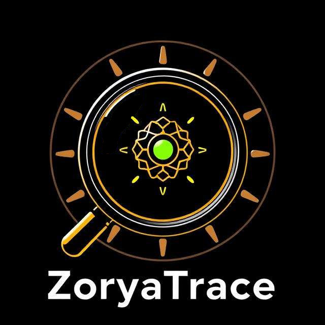

# ZoryaTrace

  

**ZoryaTrace** is a powerfull artificial intelligence algorithm designed to analyze texts and determine whether the content is AI-generated or not. In the future, it will leverage individual user data to determinate if LLM was used to generate text.

🚧 **Currently in heavy development** – many features are still being built and refined. 

📚 **Project progress bar :** 

## Table of Contents  
- [Features](#features)  
- [Status](#status)  
- [Installation](#installation)  
- [Usage](#usage)  
- [Contributing](#contributing)  
- [License](#license)  
- [Credits](#credits)  

## Features  
- **AI Detection:** Analyze text to classify AI-generated content.  
- **User-Based Analysis:** Adapt detection based on individual user patterns.  
- **Scalability:** Designed to handle large-scale text processing.  

## Status  
ZoryaTrace is in an early development phase, and its core functionality is still evolving. Contributions and feedback are welcome!  

## Installation
_Installation instructions will be added soon._  

## Usage  
_Basic usage examples will be documented as the project progresses._  

## Contributing  
Contributions are welcome! Feel free to submit issues and pull requests.  

## License  

ZoriaTrace is licensed under <a href="https://creativecommons.org/licenses/by-nc-sa/4.0/?ref=chooser-v1" target="_blank" rel="license noopener noreferrer" style="display:inline-block;">CC BY-NC-SA 4.0</a>
   

## Credits  
Developed with <3 by me.  
Special thanks to contributors and testers who help improve ZoryaTrace (there are none yet). 

